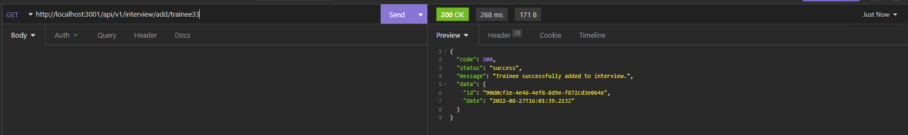

<div align="center" id="top">
  

  &#xa0;

  <!-- <a href="https://headhunterbackend.netlify.app">Demo</a> -->
</div>

<h1 align="center">Head Hunter Backend</h1>

<p align="center">
  

  

  

  

  <!--  -->

  <!--  -->

  <!--  -->
</p>

<!-- Status -->

<!-- <h4 align="center">
	🚧  Head Hunter Backend 🚀 Under construction...  🚧
</h4>

<hr> -->

<p align="center">
  <a href="#dart-about">About</a> &#xa0; | &#xa0;
  <a href="#sparkles-features">Features</a> &#xa0; | &#xa0;
  <a href="#rocket-technologies">Technologies</a> &#xa0; | &#xa0;
  <a href="#white_check_mark-requirements">Requirements</a> &#xa0; | &#xa0;
  <a href="#checkered_flag-starting">Starting</a> &#xa0; | &#xa0;
  <a href="#memo-license">License</a> &#xa0; | &#xa0;
  <a href="https://github.com/bialka104b" target="_blank">Author</a>
</p>

<br>

## :dart: About ##

This is a group project at the end of MegaK course. This backend allows to searching and hire students who ended a course. Project was made for 100% by students of MegaK.

## :sparkles: Features ##

:heavy_check_mark: Feature 1;\
:heavy_check_mark: Feature 2;\
:heavy_check_mark: Feature 3;

## :rocket: Technologies ##

The following tools were used in this project:

- [Expo](https://expo.io/)
- [Node.js](https://nodejs.org/en/)
- [Express](https://expressjs.com/)
- [TypeScript](https://www.typescriptlang.org/)
- [PassportJS](https://www.passportjs.org/)
- [Papaparse](https://www.papaparse.com/)
- [Nodemailer](https://nodemailer.com/about/)
- multer
- mysql2

## :white_check_mark: Requirements ##

Before starting :checkered_flag:, you need to have [Git](https://git-scm.com) and [Node](https://nodejs.org/en/) installed.

## :checkered_flag: Starting ##

Complete file config/config.ts

```bash
# Clone this project
$ git clone https://github.com/bialka104b/head-hunter-backend

# Access
$ cd head-hunter-backend

# Install dependencies
$ npm install

# Create database with random data
$ npm db:build

# Run the project
$ npm start:dev

# The server will initialize in the <http://localhost:3001>
```

## Structure of Database


## API Request
 - Login by admin
   
 - Login by Hr
   
 - Login by student
   
 - List of students
   
 - List of Hr
   
 - Import trainee from CSV file
   
 - Add Hr
   
 - bad CSV file
   
 - Add interview
   
 - Delete Interview
   
 - Change password
   
 - Student profile
   
 - Update student profile
   

## :memo: License ##

This project is under license from MIT. For more details, see the [LICENSE](LICENSE.md) file.


Made with :heart: by <a href="https://github.com/bialka104b" target="_blank">bialka104b</a>

&#xa0;

<a href="#top">Back to top</a>
